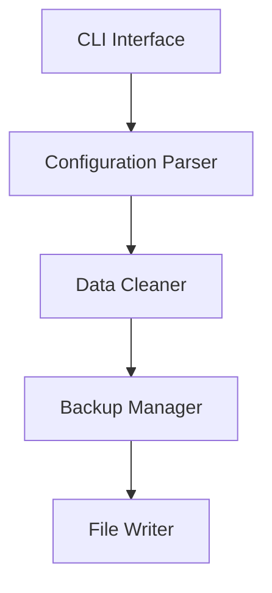

# Technology Stack

## Overview

Claude Clear is built with a carefully selected technology stack focused on reliability, performance, and maintainability. This document outlines all technologies, dependencies, and architectural decisions.

## Core Technologies

### Programming Language

#### Python 3.8+
**Why Python?**
- **Cross-platform compatibility** - Runs on Windows, macOS, and Linux
- **Rich ecosystem** - Extensive libraries for JSON processing, file operations
- **Readability** - Clean syntax that's easy to maintain
- **Rapid development** - Quick iteration and testing
- **Community support** - Large developer community and resources

**Version Requirements**:
- **Minimum**: Python 3.8 (for type hints and f-strings)
- **Recommended**: Python 3.10+ (for performance improvements)
- **Tested**: Python 3.8, 3.9, 3.10, 3.11

### Key Libraries

#### Core Dependencies
```python
# Standard library (no installation required)
import json           # JSON parsing and manipulation
import os             # Operating system interface
import pathlib        # Modern path handling
import shutil         # File operations
import datetime       # Timestamp generation
import logging        # Logging framework
import argparse       # Command-line interface
import sys            # System-specific parameters
import subprocess      # External process execution
import tempfile       # Temporary file handling
import re             # Regular expressions
import copy           # Deep copying operations
```

#### Optional Dependencies
```python
# requirements.txt
ijson>=3.2.0; python_version>="3.8"  # Streaming JSON parser
pathlib2>=2.3.7; python_version<"3.4"  # Backward compatibility
```

**Library Selection Criteria**:
- **Minimal dependencies** - Reduce attack surface and installation complexity
- **Well-maintained** - Active development and security updates
- **Cross-platform** - Consistent behavior across operating systems
- **Performance** - Efficient for large file processing

## Development Tools

### Build System

#### setuptools with pyproject.toml
```toml
# pyproject.toml
[build-system]
requires = ["setuptools>=45", "wheel"]
build-backend = "setuptools.build_meta"

[project]
name = "claude-clear"
dynamic = ["version"]
description = "Clean bloated Claude Code configuration files"
requires-python = ">=3.8"
```

**Why setuptools?**
- **Python standard** - De facto standard for Python packaging
- **Mature and stable** - Long history of reliable operation
- **Good documentation** - Extensive guides and community support
- **Integration** - Works well with CI/CD pipelines

#### Makefile for Common Tasks
```makefile
.PHONY: help install test lint format clean build

help:
	@echo "Available targets: install, test, lint, format, clean, build"

install:
	pip install -e .

test:
	python -m pytest tests/ -v

lint:
	flake8 src/ tests/
	mypy src/

format:
	black src/ tests/
	isort src/ tests/

clean:
	rm -rf build/ dist/ *.egg-info/

build:
	python -m build
```

### Testing Framework

#### pytest
```python
# pytest configuration
# pytest.ini or pyproject.toml
[tool.pytest.ini_options]
testpaths = ["tests"]
python_files = ["test_*.py"]
python_classes = ["Test*"]
python_functions = ["test_*"]
addopts = "-v --tb=short"
```

**Why pytest?**
- **Simple syntax** - Easy to write and read tests
- **Rich ecosystem** - Extensive plugin support
- **Good integration** - Works well with CI/CD systems
- **Flexible fixtures** - Powerful test data management
- **Detailed reporting** - Comprehensive test output

#### Test Coverage Tools
```python
# Coverage configuration
# .coveragerc
[run]
source = src/
omit = 
    */tests/*
    */venv/*
    */__pycache__/*

[report]
exclude_lines =
    pragma: no cover
    def __repr__
    raise AssertionError
    raise NotImplementedError
```

### Code Quality Tools

#### Black (Code Formatter)
```toml
# pyproject.toml
[tool.black]
line-length = 88
target-version = ['py38', 'py39', 'py310']
include = '\.pyi?$'
extend-exclude = '''
/(
  \.eggs
  | \.git
  | \.hg
  | \.mypy_cache
  | \.tox
  | \.venv
  | build
  | dist
)/
'''
```

#### isort (Import Sorter)
```toml
# pyproject.toml
[tool.isort]
profile = "black"
multi_line_output = 3
line_length = 88
known_first_party = ["src"]
```

#### flake8 (Linter)
```ini
# .flake8
[flake8]
max-line-length = 88
extend-ignore = E203, W503
exclude = 
    .git,
    __pycache__,
    build,
    dist,
    .venv,
    .eggs
per-file-ignores =
    __init__.py:F401
```

#### mypy (Type Checker)
```toml
# pyproject.toml
[tool.mypy]
python_version = "3.8"
warn_return_any = true
warn_unused_configs = true
disallow_untyped_defs = true
```

## Continuous Integration

### GitHub Actions

#### Workflow Configuration
```yaml
# .github/workflows/ci.yml
name: CI

on:
  push:
    branches: [ main, develop ]
  pull_request:
    branches: [ main ]

jobs:
  test:
    runs-on: ${{ matrix.os }}
    strategy:
      matrix:
        os: [ubuntu-latest, macos-latest, windows-latest]
        python-version: [3.8, 3.9, "3.10", "3.11"]

    steps:
    - uses: actions/checkout@v3
    
    - name: Set up Python ${{ matrix.python-version }}
      uses: actions/setup-python@v4
      with:
        python-version: ${{ matrix.python-version }}
    
    - name: Install dependencies
      run: |
        python -m pip install --upgrade pip
        pip install -r requirements.txt
        pip install -r requirements-dev.txt
    
    - name: Run tests
      run: |
        python -m pytest tests/ -v --cov=src/
    
    - name: Upload coverage
      uses: codecov/codecov-action@v3
```

### Security Scanning

#### Code Security Analysis
```yaml
# .github/workflows/security.yml
name: Security Scan

on: [push, pull_request]

jobs:
  security:
    runs-on: ubuntu-latest
    steps:
    - uses: actions/checkout@v3
    
    - name: Run security scan
      run: |
        pip install bandit safety
        bandit -r src/ -f json -o bandit-report.json
        safety check --json --output safety-report.json
    
    - name: Upload security reports
      uses: actions/upload-artifact@v3
      with:
        name: security-reports
        path: |
          bandit-report.json
          safety-report.json
```

## Documentation

### Documentation Tools

#### Markdown
- **Format**: GitHub-flavored markdown
- **Rendering**: GitHub Pages, README.md rendering
- **Validation**: markdownlint for consistency
- **Cross-references**: Internal linking between documents

#### Documentation Generation
```python
# Optional: Automated API documentation
# Using pydoc or Sphinx for API docs
# Currently using hand-written markdown for simplicity
```

### Diagrams and Architecture

#### Mermaid (Optional)
```markdown
# Architecture diagrams in documentation


## Performance and Monitoring

### Profiling Tools

#### Memory Profiling
```python
# memory_profiler for memory usage analysis
@profile
def memory_intensive_function():
    # Function to profile
    pass

# Command line usage
python -m memory_profiler src/cleaner.py
```

#### CPU Profiling
```python
# cProfile for CPU usage analysis
python -m cProfile -s time src/cleaner.py

# Line-by-line profiling
pip install line_profiler
kernprof -l -v src/cleaner.py
```

### Performance Monitoring

#### Built-in Metrics
```python
# Performance tracking
class PerformanceTracker:
    def __init__(self):
        self.start_time = None
        self.memory_usage = []
    
    def start_operation(self):
        self.start_time = time.time()
    
    def track_memory(self):
        import psutil
        process = psutil.Process()
        self.memory_usage.append(process.memory_info().rss)
    
    def generate_report(self) -> Dict[str, Any]:
        return {
            "duration": time.time() - self.start_time,
            "peak_memory": max(self.memory_usage),
            "average_memory": sum(self.memory_usage) / len(self.memory_usage)
        }
```

## Platform-Specific Technologies

### macOS
#### Platform Integration
```python
# macOS-specific features
import platform

class MacOSSupport:
    def __init__(self):
        self.is_macos = platform.system() == "Darwin"
    
    def enable_colors(self):
        """Enable native terminal colors."""
        if self.is_macos:
            import curses
            curses.setupterm()
    
    def get_config_path(self) -> Path:
        """Get macOS-specific config path."""
        if self.is_macos:
            return Path.home() / "Library" / "Application Support" / "Claude" / "claude.json"
        return Path.home() / ".claude.json"
```

#### LaunchAgent Support
```xml
<!-- macOS LaunchAgent for automatic execution -->
<?xml version="1.0" encoding="UTF-8"?>
<!DOCTYPE plist PUBLIC "-//Apple//DTD PLIST 1.0//EN" "http://www.apple.com/DTDs/PropertyList-1.0.dtd">
<plist version="1.0">
<dict>
    <key>Label</key>
    <string>com.claudeclear.daily</string>
    <key>ProgramArguments</key>
    <array>
        <string>/usr/local/bin/claude-clear</string>
    </array>
    <key>StartInterval</key>
    <integer>86400</integer>
</dict>
</plist>
```

### Linux
#### Distribution Support
```python
# Linux distribution detection
import platform
import distro

class LinuxSupport:
    def __init__(self):
        self.is_linux = platform.system() == "Linux"
        self.distribution = distro.name() if self.is_linux else None
    
    def get_package_manager(self) -> str:
        """Detect available package manager."""
        if shutil.which("apt-get"):
            return "apt"
        elif shutil.which("yum"):
            return "yum"
        elif shutil.which("dnf"):
            return "dnf"
        elif shutil.which("pacman"):
            return "pacman"
        return "unknown"
```

#### systemd Service
```ini
# systemd service file
[Unit]
Description=Claude Clear Daily Cleanup
After=network.target

[Service]
Type=oneshot
ExecStart=/usr/local/bin/claude-clear
User=%i
Group=%i

[Install]
WantedBy=timers.target
```

### Windows
#### Windows Integration
```python
# Windows-specific features
import platform
import ctypes

class WindowsSupport:
    def __init__(self):
        self.is_windows = platform.system() == "Windows"
    
    def enable_colors(self):
        """Enable color support on Windows."""
        if self.is_windows:
            import colorama
            colorama.init()
    
    def handle_long_paths(self):
        """Enable long path support."""
        if self.is_windows:
            import ctypes
            ctypes.windll.kernel32.SetDllDirectoryW("C:\\Program Files\\Claude Clear")
```

#### Task Scheduler
```xml
<!-- Windows Task Scheduler XML -->
<?xml version="1.0" encoding="UTF-16"?>
<Task version="1.2" xmlns="http://schemas.microsoft.com/windows/2004/02/mit/task">
  <RegistrationInfo>
    <Date>2025-10-31T12:34:56.789</Date>
    <Author>Claude Clear</Author>
    <Description>Daily Claude Code configuration cleanup</Description>
  </RegistrationInfo>
  <Triggers>
    <CalendarTrigger>
      <StartBoundary>2025-10-31T02:00:00</StartBoundary>
      <Enabled>true</Enabled>
      <ScheduleByDay>
        <DaysInterval>1</DaysInterval>
      </ScheduleByDay>
    </CalendarTrigger>
  </Triggers>
  <Principals>
    <Principal id="Author">
      <UserId>DOMAIN\username</UserId>
      <LogonType>InteractiveToken</LogonType>
    </Principal>
  </Principals>
  <Actions>
    <Exec>
      <Command>C:\Python39\Scripts\claude-clear.exe</Command>
    </Exec>
  </Actions>
</Task>
```

## Data Technologies

### JSON Processing

#### Standard JSON Library
```python
# Built-in JSON processing
import json

# Basic usage
with open('config.json', 'r') as f:
    data = json.load(f)

# Writing JSON
with open('config_cleaned.json', 'w') as f:
    json.dump(data, f, indent=2)
```

#### Streaming JSON (ijson)
```python
# For large files
import ijson

# Streaming parsing
with open('large_config.json', 'rb') as f:
    parser = ijson.parse(f)
    for prefix, event, value in parser:
        if prefix == 'projects.item.history':
            # Process history items as they arrive
            pass
```

### File System Operations

#### pathlib for Cross-Platform Paths
```python
from pathlib import Path

# Cross-platform path operations
config_path = Path.home() / ".claude.json"
backup_path = config_path.with_suffix('.json.backup')

# Directory operations
backup_dir = Path.home() / ".claude-clear" / "backups"
backup_dir.mkdir(parents=True, exist_ok=True)
```

#### Atomic File Operations
```python
import tempfile
import shutil

def atomic_write(file_path: Path, data: str):
    """Write data atomically to prevent corruption."""
    with tempfile.NamedTemporaryFile(
        mode='w', 
        dir=file_path.parent, 
        delete=False
    ) as tmp_file:
        tmp_file.write(data)
        tmp_path = Path(tmp_file.name)
    
    # Atomic move
    shutil.move(tmp_path, file_path)
```

## Security Technologies

### Input Validation

#### Regular Expressions
```python
import re

# Path validation
SAFE_PATH_PATTERN = re.compile(r'^[a-zA-Z0-9_\-/\.]+$')

# JSON structure validation
JSON_KEY_PATTERN = re.compile(r'^[a-zA-Z_][a-zA-Z0-9_]*$')
```

#### Type Safety
```python
from typing import Dict, List, Optional, Union, Any

# Type hints for safety
def process_data(
    data: List[str], 
    threshold: Optional[int] = None
) -> Dict[str, Any]:
    """Type-safe data processing."""
    pass
```

### Secure Coding Practices

#### Error Handling
```python
# Secure error messages
class SecureError(Exception):
    def __init__(self, user_message: str, technical_details: str = None):
        self.user_message = user_message
        self.technical_details = technical_details
        super().__init__(user_message)
    
    def __str__(self) -> str:
        return self.user_message  # Only user-friendly message
```

## Deployment Technologies

### Package Distribution

#### PyPI Distribution
```python
# Built distribution packages
# claude-clear-1.0.0-py3-none-any.whl
# claude-clear-1.0.0.tar.gz

# Installation
pip install claude-clear
```

#### Container Support
```dockerfile
# Dockerfile for containerized deployment
FROM python:3.10-slim

WORKDIR /app
COPY requirements.txt .
RUN pip install -r requirements.txt

COPY src/ ./src/
COPY bin/ ./bin/

ENTRYPOINT ["python", "src/cleaner.py"]
```

### Version Management

#### Semantic Versioning
```python
# Version format: MAJOR.MINOR.PATCH
__version__ = "1.0.0"

# Version components
MAJOR = 1      # Breaking changes
MINOR = 0       # New features (backward compatible)
PATCH = 0       # Bug fixes (backward compatible)
```

## Future Technology Considerations

### Potential Enhancements

#### Performance Technologies
- **Rust integration** for performance-critical components
- **Cython compilation** for speed optimization
- **Async processing** for concurrent operations

#### User Interface Technologies
- **Tkinter** for simple GUI (built-in)
- **Web interface** using Flask/FastAPI
- **Electron** for cross-platform desktop app

#### Advanced Features
- **SQLite database** for configuration caching
- **Plugin system** using entry points
- **Configuration validation** using JSON Schema

### Technology Evaluation Criteria

#### Selection Principles
1. **Simplicity** - Prefer simple, well-understood technologies
2. **Reliability** - Choose mature, stable libraries
3. **Performance** - Optimize for the actual use case
4. **Maintenance** - Consider long-term maintenance burden
5. **Security** - Prioritize security track record
6. **Cross-platform** - Ensure compatibility across platforms

#### Evaluation Process
```python
# Technology evaluation framework
class TechnologyEvaluator:
    def evaluate(self, technology: str) -> EvaluationResult:
        criteria = [
            "performance",
            "security", 
            "maintenance",
            "community",
            "documentation",
            "licensing"
        ]
        
        scores = {}
        for criterion in criteria:
            scores[criterion] = self._score_criterion(technology, criterion)
        
        return EvaluationResult(
            technology=technology,
            scores=scores,
            recommendation=self._make_recommendation(scores)
        )
```

## Technology Rationale

### Why This Stack Works for Claude Clear

#### 1. Python Ecosystem
- **JSON processing**: Excellent built-in and third-party libraries
- **File operations**: Cross-platform pathlib and shutil
- **CLI development**: Rich ecosystem of argparse and click
- **Testing**: Mature pytest framework
- **Packaging**: Standard setuptools and PyPI infrastructure

#### 2. Minimal Dependencies
- **Security**: Reduced attack surface
- **Installation**: Faster, more reliable
- **Maintenance**: Lower dependency management burden
- **Performance**: Less overhead from unused libraries

#### 3. Cross-Platform Focus
- **User base**: Claude Code users on all major platforms
- **Development**: Single codebase for all platforms
- **Testing**: Matrix testing across platforms
- **Deployment**: Universal package with platform-specific scripts

#### 4. Performance Characteristics
- **Memory efficiency**: Streaming JSON for large files
- **Speed**: Optimized algorithms for data cleaning
- **Scalability**: Handles files from KB to hundreds of MB
- **Resource usage**: Minimal CPU and memory footprint

---

This technology stack is designed to provide a solid foundation for Claude Clear's current needs while allowing for future growth and enhancement. The focus on simplicity, reliability, and cross-platform compatibility ensures the tool can serve the widest possible user base.

**Last Updated**: 2025-10-31
**Next Review**: 2026-04-30
**Technology Lead**: Development Team